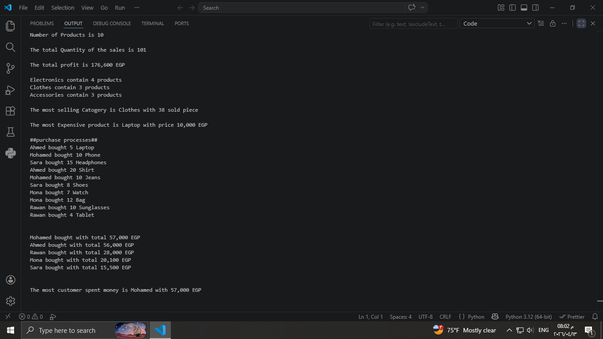

# 📊 Sales Analysis Project

## 📌 Overview
This project analyzes sales data using Python and SQL to extract meaningful business insights.

## 🛠 Technologies Used
- Python
- MySQL

## 📊 Features
- Calculate total sales and revenue
- Identify most selling category
- Analyze customer purchases using JOIN
- Find top customers
- Detect most expensive products

## 🧠 What I Learned
- Database design
- Writing SQL queries (JOIN, GROUP BY, Aggregations)
- Connecting Python with MySQL
- Extracting insights from data

## 🚀 Future Improvements
- Add data visualization
- Build ETL pipeline

## 📸 Sample Output

